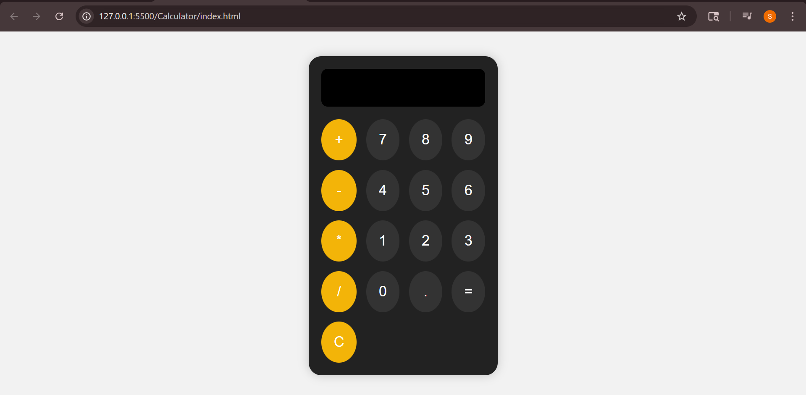

# 📱 Simple Calculator

A basic calculator built using HTML, CSS, and JavaScript — styled like a mobile phone calculator.

## ✨ Features

- Supports +, −, ×, ÷, and decimals
- Clean mobile-style layout
- Responsive design
- Light JavaScript logic using `eval()` (for learning purposes)

## 📸 Screenshot



## 🚀 How to Run

1. Clone or download the repository:
   ```bash
   git clone https://github.com/your-username/calculator.git
   cd calculator
