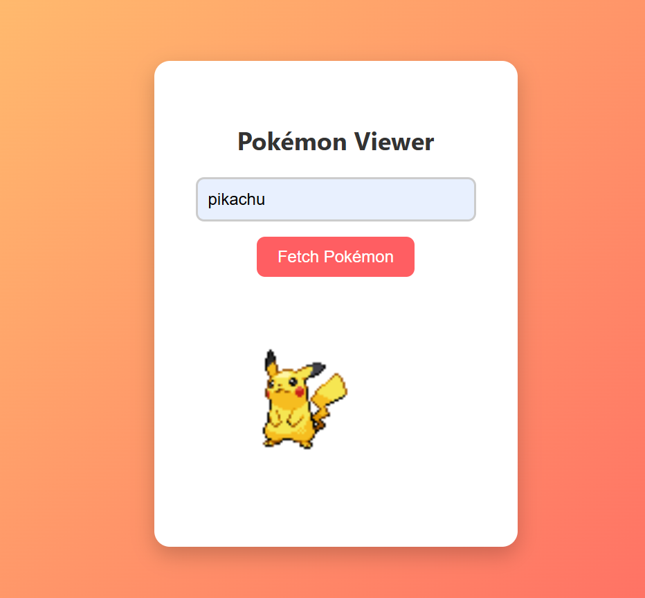

# 🧩 Pokémon Viewer

A simple and visually appealing web application that lets users search for a Pokémon by name and displays its image using the [PokéAPI](https://pokeapi.co/).

---

## 🔍 Features

- Fetches data from the PokéAPI
- Displays the official front image of the Pokémon
- Responsive, gradient-themed design
- Graceful error handling for invalid names

---

## 🖥️ Preview

  
*A minimal card UI showing Pokémon images by name.*

---
