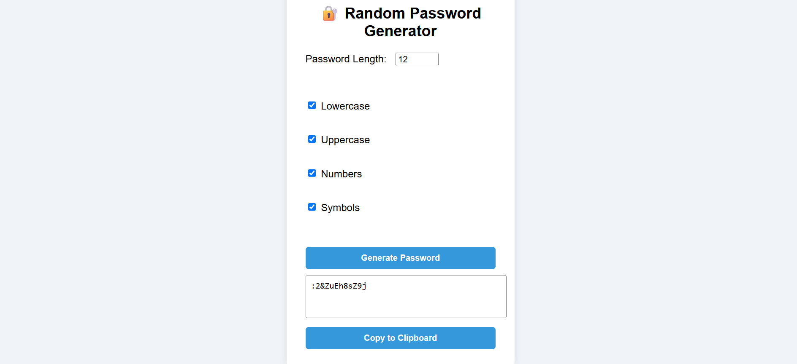

# 🔐 Random Password Generator

A simple and secure web application to generate random passwords based on user-selected criteria. Built using HTML, CSS, and JavaScript — designed to demonstrate frontend development and logical programming skills.

---

## 🛠️ Tech Stack

- **HTML5** – Structure and form elements
- **CSS3** – Styling and layout
- **JavaScript (ES6)** – Password logic, DOM interaction, clipboard copy

---

## ✨ Features

- Generate passwords of custom length
- Choose from lowercase, uppercase, numbers, and symbols
- Real-time password generation
- Copy-to-clipboard functionality
- Clean, responsive user interface

---

## 🎯 Project Scope

This project demonstrates my ability to:
- Work with HTML/CSS/JS in separate files (modular structure)
- Implement logical features (random character generation)
- Create user-friendly UI with form validation
- Handle DOM events and dynamic updates
- Deploy and document real-world mini projects on GitHub

---

## 📸 Screenshot




---

## 🚀 Getting Started

To run locally:

```bash
git clone https://github.com/SoniSingh17/password-generator.git
cd password-generator
open index.html
