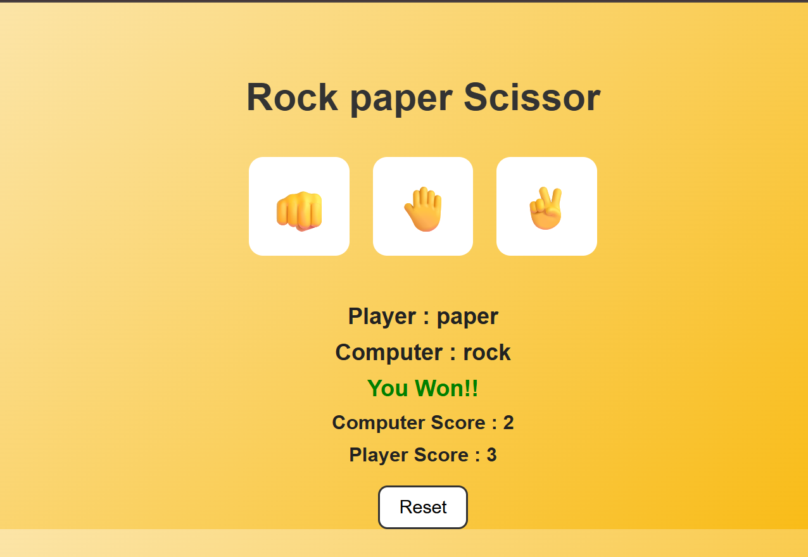

# Rock Paper Scissors 🪨📄✂️

A simple and fun Rock-Paper-Scissors game built using **HTML**, **CSS**, and **JavaScript**.

## 🎮 Features

- Three choices: Rock 👊, Paper 🤚, Scissor ✌️
- Dynamic result with color feedback:
  - 🟢 Green for Win
  - 🔴 Red for Lose
  - ⚪ Gray for Tie
- Score tracking for both Player and Computer
- Reset button to clear scores and start over
- Clean and colorful UI

## 🛠️ Technologies Used

- **HTML** – Structure
- **CSS** – Styling and layout
- **JavaScript** – Game logic and DOM manipulation

## 🚀 How to Run

1. Clone or download this repository.
2. Open `index.html` in any modern web browser.
3. Play and enjoy!

