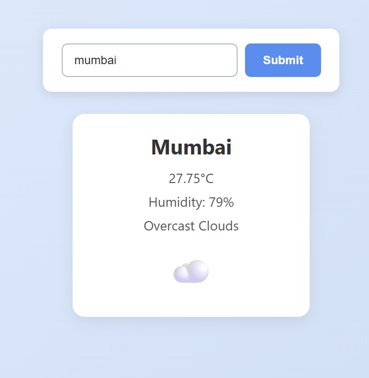

# Weather App

A sleek, responsive weather application built with vanilla JavaScript, HTML, and CSS.  
Fetches live weather data from the OpenWeatherMap API and displays detailed information including temperature, humidity, description, and weather icons.

---

## 📸 Screenshot

  
*Example view of the weather app in action.*

---

## 🚀 Features

- Search weather by city name.
- Displays temperature (°C), humidity (%), and weather description.
- Shows matching emoji based on weather conditions.
- Responsive layout for both desktop and mobile devices.
- User-friendly error messages for invalid inputs.
- Clean, modern, and accessible design.

